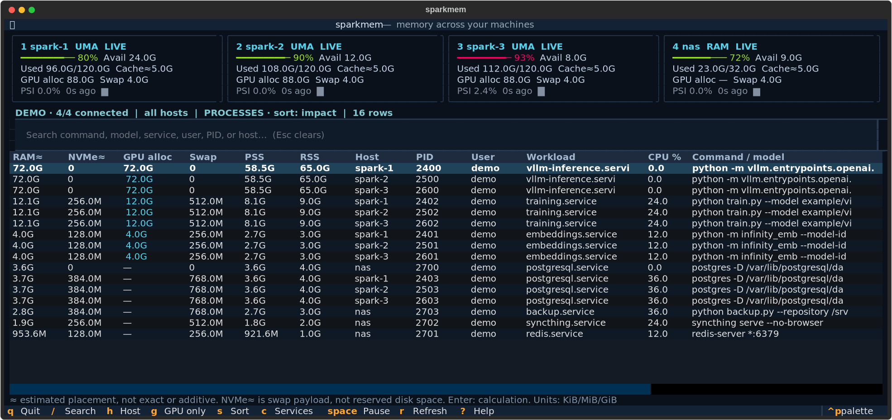

# sparkmem

A customizable terminal memory monitor for a fleet of **NVIDIA DGX Sparks and Linux servers**. See all your hosts, identify what those `python` processes actually run, and inspect their memory without installing agents on the remote machines.

**UMA-aware:** system RAM is one shared pool. Linux PSS/RSS and NVIDIA GPU allocations appear side by side. The leading **RAM≈** and **NVMe≈** columns estimate placement; they are explicitly approximate because Linux does not expose per-process compressed sizes or CPU/GPU overlap.



## Install and run

Requires Python 3.11+ and OpenSSH on the machine running the TUI. Remote Linux hosts only need Python 3.8+, `/proc`, and optionally `nvidia-smi`.

```sh
uv tool install git+https://github.com/tom-doerr/sparkmem.git
sparkmem
```

Or clone for customization:

```sh
git clone https://github.com/tom-doerr/sparkmem.git
cd sparkmem
uv sync
uv run sparkmem
```

Defaults to `spark-1`, `spark-2`, `spark-3`, and `nas`. A matching local hostname is collected locally; other hosts use your SSH aliases, keys, known hosts, and connection settings. Establish a normal SSH connection first if a host is new. Sampling never prompts for passwords or sudo. No service installation or Docker socket access is required.

```sh
sparkmem --hosts localhost another-server user@nas
sparkmem --demo                           # Synthetic data; works offline
sparkmem --json                           # One sample for scripts; failure exit status if a host fails
sparkmem --hosts spark-3 --pss-limit 0     # PSS for every accessible process
```

## What you can see

- All hosts' available/used RAM, cache estimate, swap, 10-second memory pressure, and recent usage history.
- Process columns start with **RAM≈, NVMe≈, GPU alloc, Swap, PSS, RSS**, followed by identity and command columns. All memory columns can be sorted.
- Compression estimates prefer cgroup zswap counters, with host averages as a fallback. Actual zram allocator usage, zram writeback, and zswap counters are available in details; device-mapper layers are inspected before identifying storage as NVMe.
- Enter opens the complete command, executable, working directory, parent PID, user, GPU context, cgroup, and host memory breakdown.
- Service/container memory charged through cgroup v2, including file cache. This also works on a CPU-only NAS.
- GPU compute **and graphics** processes, merged by host PID. Unavailable counters remain unknown.
- Independent polling: a slow or disconnected host does not freeze the others. Last successful samples remain visible and are marked stale.
- Compact host cards on short terminals; narrow terminals prioritize memory and command columns. Full details remain available with Enter.

## Keys

| Key | Action |
| --- | --- |
| `/`, Enter, Esc | Search, return to table, clear filters / close details |
| Enter on a row | Inspect full process or service details |
| `h`, `1`–`4`, `0` | Cycle host, select host, show all hosts |
| `g` | Only processes with GPU contexts |
| `s` / click memory header | Change descending sort |
| `c` | Toggle process and service/container views |
| Space, `r` | Pause polling, force a refresh |
| `?`, `q` | Help, quit |
| Tab, arrows, PageUp/PageDown | Move focus and navigate/scroll |

## Make it yours

```sh
mkdir -p ~/.config/sparkmem
sparkmem --print-config > ~/.config/sparkmem/config.toml
```

Edit the TOML to set host names/SSH targets, remote Python paths, `transport = "local"` or `"ssh"`, refresh interval, timeout, PSS sampling budget, columns, theme, and regex workload labels. `uma = true` explicitly marks shared memory; otherwise GB10 is detected. Set `gpu = false` for CPU-only hosts. Restart to apply edits. An explicit `--config path.toml` is also supported. Unknown settings and invalid values are rejected.

For example, name otherwise opaque Python processes or container IDs:

```toml
[[labels]]
pattern = "infinity_emb|venvs/infinity"
name = "Embeddings / reranker"
```

The first case-insensitive matching label wins; otherwise a service/container cgroup or process name is shown. The complete example is in [`src/sparkmem/example.toml`](src/sparkmem/example.toml).

The implementation stays small: `probe.py` reads Linux/NVIDIA data using only the standard library; `collector.py` handles transport and accounting; `config.py` controls customization; `ui.py` and `style.tcss` control the terminal UI.

## Reading the numbers correctly

| Counter | Meaning |
| --- | --- |
| Used / available | Used = `MemTotal − MemAvailable`. Available is Linux's estimated allocation headroom without swapping, not a CUDA allocation guarantee. |
| Cache≈ | `Cached + Buffers + SReclaimable − Shmem`, clamped to zero. An estimate, not entirely reclaimable and not an extra pool. |
| RAM≈ | Resident-memory heuristic plus estimated physical compressed-swap RAM. See the calculation below; not an exact footprint or bound. |
| NVMe≈ | Estimated swap payload outside compressed RAM on verified NVMe backing. Not reserved swapfile space or total process file usage. |
| PSS / RSS | **Proportional Set Size / Resident Set Size.** PSS apportions shared resident pages; RSS counts shared mappings in full for each process. Neither includes swapped-out pages or is a CPU-only total on UMA. |
| USS | Private clean + dirty resident mappings, shown in process details. |
| GPU alloc | Driver-reported per-process allocations from `nvidia-smi -q -x`, including graphics. Unknown allocations are preserved as unknown. |
| Impact sort | `max(PSS if available else RSS, GPU allocation)`. A ranking heuristic, **not** an exact physical footprint. |
| Swap | System swap use or process `VmSwap`; process swap excludes shmem swap. Zswap details are shown when available. |
| PSI | `some.avg10`: percentage of the last 10 seconds with at least some tasks stalled for memory. |
| Charged | cgroup v2 `memory.current`, including descendants and charged file cache. **Parent/child rows overlap**; don't sum them. |
| Zswap RAM | Measured cgroup `memory.zswap.current`. Details also show the logical bytes stored, host zswap pool size, and zram physical allocation including allocator overhead. |

All displayed sizes are binary (K/M/G/T = KiB/MiB/GiB/TiB); JSON byte counters are bytes, PSI/CPU/utilization are percentages, and timestamps/durations are seconds. CPU usage uses interval deltas with one core equal to 100%.

NVIDIA's global framebuffer total is unsupported on the Spark because it has no dedicated VRAM pool. GPU allocations and CPU mappings can overlap, and driver accounting does not reveal that overlap. Consequently there is no exact additive CPU/GPU process total, and summing the process rows cannot explain all physical RAM (kernel, cache, driver allocations, permissions, and sharing all matter).

For example, a 1 GiB resident mapping shared by two processes contributes 1 GiB to each process's RSS, but only 512 MiB to each process's PSS. Swap is separate from both.

### How the approximate columns work

**RAM≈** uses `PSS` (or `RSS` when PSS is unavailable). On UMA, it takes `max(that, GPU allocation)` to avoid simply adding overlapping counters. It then adds an estimated share of the physical compressed-swap pool. This heuristic can **undercount disjoint CPU/GPU allocations**, and RSS fallback can overcount shared mappings. Unmapped file cache, shared/tmpfs swap and other unattributed kernel/driver memory are not fully covered. Do not sum these rows or interpret them as exact physical bounds.

For zswap, let `s` be process `VmSwap`, and let `S`, `C`, and `Z` be the nearest usable cgroup's logical swap, compressed zswap bytes, and logical bytes stored in zswap. The process estimates are:

```text
compressed RAM ≈ s × C / S
NVMe payload   ≈ s × (1 − min(1, Z / S))
```

If usable cgroup counters are absent, the host counters supply `S`, `C`, and `Z`. This assumes the process has its scope's average compression and placement; different processes can differ substantially. Details identify the attribution source. Cgroup charge ownership, shared swap, swap cache and changing samples also prevent exact attribution.

The zswap NVMe estimate is only shown when all **currently used** disk swap backing is verified as NVMe. Mixed or unknown disks show `—`; entirely non-NVMe disk swap shows zero in that column. Device-mapper/RAID slaves and partitions are followed through sysfs. Unresolved loop/filesystem backing remains unknown.

For active zram without zswap, the estimate apportions the host's measured zram `mem_used_total` (including allocator fragmentation/metadata) and NVMe swap/writeback payload by each process's logical swap share. It does not substitute `compr_data_size` for actual RAM use. Zram `bd_stat` writeback units are 4 KiB, independent of the machine's page size. Simultaneously active zswap and zram compression layers or missing required counters show `—` rather than inventing an exact split.

**NVMe≈ describes estimated swap payload, not physical filesystem occupancy.** Swapfiles/partitions are preallocated, and zswap still reserves their swap slots. Zero pages can skip disk writes. Mapped model files, filesystem compression, allocation overhead and unrelated files are excluded. The measured host device slot totals and compression counters remain available alongside these estimates.

PSS sampling reads the largest 80 RSS processes plus every GPU process by default. Reading all page tables can be expensive; use `pss_limit = 0` for full coverage. `—` means inaccessible, unsupported, or unsampled, never zero. Other users' PSS, commands, and paths may be restricted. Cgroup v1 still supports process and host memory but does not expose the v2 services view. Container names are not fetched from the Docker daemon; identify cgroup IDs with regex labels if needed. Parent and child cgroups remain separate, overlapping observations.

The monitor only reads state. It does not clear caches, stop processes, restart containers, or change host configuration. Command lines and paths can contain private data; the synthetic demo is suitable for public screenshots. JSON snapshots retain full observed command lines and paths.

Sources: [NVIDIA UMA memory guidance](https://docs.nvidia.com/dgx/dgx-spark/known-issues.html), [Linux `/proc` counters](https://docs.kernel.org/filesystems/proc.html), [Linux cgroup v2 memory controller](https://docs.kernel.org/admin-guide/cgroup-v2.html), [zswap](https://docs.kernel.org/admin-guide/mm/zswap.html), [zram statistics](https://docs.kernel.org/admin-guide/blockdev/zram.html), [NVIDIA SMI](https://docs.nvidia.com/deploy/nvidia-smi/).

## Development

```sh
uv sync --group dev
uv run pytest
uv run ruff check .
uv run sparkmem --demo
```

Tests exercise UMA accounting, NVIDIA XML, partial permissions, SSH timeouts, PID reuse, configuration, and keyboard flows using Textual's headless test driver. CI runs on Python 3.11–3.13. The remote probe intentionally has no third-party dependencies.

MIT licensed.
